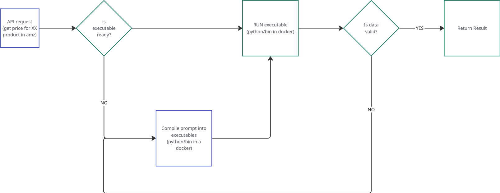

# AI-Compiler

AI-Compiler项目的灵感源自于使用apify.com, apify上有很多失效的爬虫. 这些爬虫理论上应该很容易维护, 比如由于原网页html结构变了, 那么一些数据的爬取想要修复只需要修改一些css selector就可以做到. 这种事如果没有人来发现问题, 就没有办法继续工作. 但是这件事理论上对AI来讲是很简单的, 只需要偶尔验证一下运行结果, 发现错误的话, 让ai自己的去修复就好. 

把这件事推广一下的话, 很多过去使用llm来解决的问题(比如整理固定格式的数据等)其实是可以用生成python脚本去运行的方式去解决, 这样就减少了系统的消耗. 

目前实现了AI compile的过程, 可以通过用户的prompt生成python, 然后打包进docker, 之后运行测试数据, 验证结果. 如果验证失败就会把上轮的结果和代码一起发给下一轮compile的过程, 直到结果数据验证成功. 

目前碰到的问题是: 循环compile, python代码虽然不断地被修改, 但是一直无法满足evaluation的条件. 尝试了使用本地qwen32b和openai的4o都无法解决. 猜想是因为evaluatino只验证结果, 但是代码的修改是需要基于debug的过程, 如果无法分析到问题的源头, 那么llm也就只能瞎改, 无法真正解决问题. 

目前项目先暂停, 等有好的方法或者模型再继续. 

---
5/13/2025 update:

仔细想了下代码生成的过程, 在ai生成解析代码的时候, 它并不知道具体亚马逊页面的html是什么样子, 所以生成的解析代码是完全没有根据的. 类似的情况也可能会出现在其他的api请求过程中, 如果api没有详细的结构化文档喂给AI模型的话.

那么这里的理想的处理方式是把问题拆分, 1. 保证能够稳定的获取页面内容; 2. 解析页面. 这两个问题都分别需要ai compiler去生成相应的可执行文件/docker. 但是这又需要建立可执行文件的流水线机制. 这样机制的建立需要把可执行docker变成服务的docker, 这里又牵扯到服务隔离的问题. 那么目前看起来并不必要做到这么复杂. 

目前的简单做法是直接写一个获取亚马逊页面的function, compile的时候获取内容, 并把页面内容作为prompt的一部分传给llm, 让llm去写解析的代码.

同时在生成docker的时候, 把这么个util funciton也打包到docker里面, 让生成的python程序可以调用到.

这个机制从理论上应该是可行的, 但是在本地运行环境中遇到了llm的上下文窗口长度问题, 导致生成的python代码完全不是解析的代码. 这事目前还没好的方案, 除非能让llm上下文窗口够大.